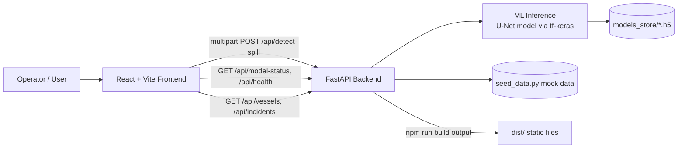

# AeroMarine AI — Maritime Intelligence Command Center

A maritime surveillance and oil-spill intelligence dashboard combining live vessel tracking, AI-powered SAR-image oil-spill detection, incident reporting, and temporal playback. Built for Smart India Hackathon (SIH).

## Overview

AeroMarine AI is a command-center style web application for monitoring maritime activity and marine pollution incidents. It presents an interactive map of vessels and oil-spill events, lets an operator upload a satellite/SAR image and run it through a trained deep-learning segmentation model to detect oil spills, and provides analytics, incident reports, and notifications around that data.

- **What it does** — visualizes vessel traffic and historical oil-spill incidents on a live map, runs real ML inference on uploaded SAR images to detect and outline oil spills, and surfaces the results through dashboards, PDF reports, and notifications.
- **Problem it solves** — gives a single operational view for maritime pollution monitoring: correlating vessel positions with spill zones and turning a raw satellite image into an actionable, quantified spill assessment (area, confidence, contours) without manual image analysis.
- **Who it's for** — coast guard / maritime authority style operators, or a hackathon demo audience, needing a visual, near-real-time maritime pollution monitoring tool.

The project has two parts:

- **`src/`** — React + TypeScript + Tailwind CSS frontend (Vite), the "Maritime Intelligence Command Center" UI.
- **`server/`** — FastAPI backend that serves a real trained U-Net oil-spill segmentation model plus supporting mock data endpoints.

## Features

- **Live monitoring map** (Leaflet) showing vessel positions, routes, and oil-spill zones, with legend, search/filters, and an asset sidebar/details panel.
- **AI oil-spill detection** — upload a SAR/satellite image and get a real model-backed prediction: spill probability mask, contour polygons, estimated affected area (km²), and confidence score.
- **Timeline playback** of historical oil-spill/vessel activity via `TimelinePlayback`.
- **Incident reports** section with an AI analysis summary and PDF report generation (`OilSpillPdfGenerator`, `jspdf`).
- **Analytics dashboard** with KPI cards and status widgets.
- **Notifications** system (panel + dropdown) that can jump the map to a related vessel or incident.
- **Theming** via a React context (`ThemeContext`), collapsible/hidden sidebar modes, and a settings page.
- **Backend health / model-status checks** — the frontend detects whether the backend is reachable and whether the ML model finished loading, and degrades gracefully to mock data if not.

## Tech Stack

| Layer | Technology |
|---|---|
| Frontend framework | React 19 + TypeScript, built with Vite |
| Styling | Tailwind CSS 4 (via `@tailwindcss/postcss`), PostCSS, Autoprefixer |
| Mapping | Leaflet + `@types/leaflet` |
| PDF generation | `jspdf` |
| Icons | `lucide-react` |
| Linting | `oxlint` |
| Backend framework | FastAPI (Python), served by Uvicorn |
| ML / inference | TensorFlow + `tf-keras` (Keras 2 compatibility layer), Pillow, NumPy, OpenCV (`opencv-python-headless`) |
| Backend utilities | `python-multipart` (file uploads), `httpx`, `python-dotenv` |
| Trained model | Keras/TensorFlow U-Net segmentation model (`server/models_store/best_model.h5`, `final_model.h5`) |

Only the packages declared in [package.json](package.json) and [server/requirements.txt](server/requirements.txt) are listed above — no other frameworks or services are used.

## Project Structure

```
AeroMarine-AI/
├── src/                        # Frontend (React + TypeScript)
│   ├── components/
│   │   ├── aerospace/          # Map, tracking, asset list/details, spill layers
│   │   ├── ai/                 # Spill analyzer, AI summary, PDF report generator
│   │   ├── common/             # Notification panel, page header, user menu
│   │   ├── dashboard/          # KPI cards, status widgets
│   │   ├── layout/             # Navbar, sidebar, notification dropdown, register modal
│   │   ├── map/                # Geo/map utility helpers
│   │   └── timeline/           # Timeline playback control
│   ├── pages/                  # Dashboard, OilSpillDetection, IncidentReports, Analytics, Settings
│   ├── context/                # ThemeContext (light/dark theming)
│   ├── data/                   # Mock/seed data (incidents, vessels, KPIs, notifications, oil spills)
│   ├── hooks/                  # useMaritimeSimulation
│   ├── lib/                    # api.ts — backend API client
│   ├── types/                  # Shared TypeScript types
│   ├── App.tsx                 # App shell, section routing, sidebar/notification state
│   └── main.tsx                # Vite/React entry point
├── server/                     # Backend (FastAPI + ML inference)
│   ├── main.py                 # FastAPI app, CORS, router registration, static frontend serving
│   ├── ml/
│   │   ├── model_loader.py     # Loads the Keras model via tf-keras, exposes model status
│   │   └── inference.py        # Runs detection on an uploaded image
│   ├── routers/
│   │   ├── detect.py           # /api/model-status, /api/detect-spill
│   │   ├── incidents.py        # /api/incidents, /api/incidents/oil-spill
│   │   └── vessels.py          # /api/vessels
│   ├── services/                # Supporting service modules
│   ├── seed_data.py             # Mock incidents / vessel seed data
│   ├── models_store/             # Trained model files (best_model.h5, final_model.h5)
│   └── requirements.txt
├── public/                      # Static assets (favicon, icons)
├── dist/                        # Production build output (generated by `npm run build`)
├── index.html                   # Vite HTML entry point
├── package.json
└── vite.config.ts
```

## System Architecture

The frontend is a single-page React app that talks to the FastAPI backend over HTTP for oil-spill detection and (optionally) vessel/incident data; everything else in the dashboard runs on local mock data (`src/data/`) so the UI is fully usable even if the backend is offline.



In production, the FastAPI server can also serve the built frontend directly (`StaticFiles` mount on `dist/`), so the whole app can run from a single host:port. In local development, the frontend (Vite dev server, port 5173) and backend (Uvicorn, port 8000) run as two separate processes, connected via CORS.

## Prerequisites

- **Node.js** (a version compatible with Vite 8 / TypeScript ~6.0 — Node 18+ recommended) and npm
- **Python 3** (the checked-in `__pycache__` files indicate development under Python 3.13)
- `pip` for installing backend dependencies

## Installation

Clone/open the repository, then install each part separately.

**Frontend:**
```bash
npm install
```

**Backend:**
```bash
cd server
pip install -r requirements.txt
```
A virtual environment is recommended:
```bash
python -m venv venv
venv\Scripts\activate   # Windows
pip install -r requirements.txt
```

## Environment Variables

| Location | Variable | Purpose |
|---|---|---|
| `.env` (root) | `GFW_API_TOKEN` | Token referenced for Global Fishing Watch–style AIS vessel data context |
| `server/.env` | `GFW_API_TOKEN` | Same token, used by the backend |
| Frontend build-time | `VITE_API_BASE_URL` | Overrides the API base URL when the frontend and backend are hosted separately (defaults to same-origin/empty string — see [src/lib/api.ts](src/lib/api.ts)) |

Example `.env`:
```env
GFW_API_TOKEN=your_gfw_api_token
```

Example frontend override (e.g. `.env.local`):
```env
VITE_API_BASE_URL=http://localhost:8000
```

Never commit real tokens — `.env` files should stay untracked (see `.gitignore`/`server/.gitignore`).

## Running the Project

**Frontend (dev server):**
```bash
npm run dev
```
Opens at `http://localhost:5173`.

**Backend (API server):**
```bash
cd server
uvicorn main:app --reload --port 8000
```
Health check: `http://localhost:8000/api/health`
Interactive API docs (Swagger UI): `http://localhost:8000/docs`

The frontend's "Oil Spill Detection" page automatically talks to the backend at `http://localhost:8000` if it's running, and shows an "offline" notice otherwise — the rest of the dashboard continues to work on mock data either way.

## Build

```bash
npm run build
```
Runs `tsc -b` followed by `vite build`, producing static output in `dist/`. Preview the production build locally with:
```bash
npm run preview
```

The backend can serve this `dist/` output directly once built, so the built frontend and API can run from a single FastAPI process.

## Testing

No automated test suite (unit/integration) is present in this repository. The only quality-check script defined is linting:
```bash
npm run lint
```
which runs `oxlint` per [.oxlintrc.json](.oxlintrc.json).

## API Documentation

All backend routes are prefixed `/api` and defined under `server/routers/`.

### Detection (`server/routers/detect.py`)

| Method | Endpoint | Description |
|---|---|---|
| GET | `/api/model-status` | Returns the loaded model's metadata (path, input/output shapes, dtypes, Keras version, load state/errors). |
| POST | `/api/detect-spill` | Runs oil-spill segmentation on an uploaded image. |

**`POST /api/detect-spill`**
```
POST /api/detect-spill?coverage_area_km2=100
Content-Type: multipart/form-data
  file: <image>   (PNG/JPEG/BMP/TIFF)
```
`coverage_area_km2` is the real-world area the whole uploaded image represents, used to convert the predicted spill-pixel fraction into a km² estimate.

Response:
```json
{
  "spillDetected": true,
  "spillPixelFraction": 0.081,
  "areaKm2": 8.1,
  "confidence": 92.4,
  "polygons": [[[0.21, 0.33], [0.24, 0.30]]],
  "overlayPngBase64": "...",
  "originalSize": { "width": 512, "height": 512 },
  "modelInputSize": 256
}
```
- `polygons` — detected-region contours, normalized to `[0,1]` in image space.
- `overlayPngBase64` — a magenta, probability-weighted PNG overlay (256×256) blended over the source image on the frontend (`mix-blend-screen`).

### Incidents (`server/routers/incidents.py`)

| Method | Endpoint | Description |
|---|---|---|
| GET | `/api/incidents` | Returns the list of seeded incident records. |
| GET | `/api/incidents/oil-spill` | Returns the seeded oil-spill incident record. |

### Vessels (`server/routers/vessels.py`)

| Method | Endpoint | Description |
|---|---|---|
| GET | `/api/vessels` | Returns a normalized list of vessels with current AIS position, heading, speed, status, and historical route/track points, derived from an in-file `VESSELS_DATA` seed set. |

### Health

| Method | Endpoint | Description |
|---|---|---|
| GET | `/api/health` | Basic liveness check (`{"status": "ok", "service": "aeromarine-ai-backend"}`). |

## Database

There is no database. Vessel and incident data is seeded in-code (`server/seed_data.py`, `server/routers/vessels.py`) and served directly from these routers; detection results are computed on demand and not persisted. Additional mock data used purely on the frontend lives in `src/data/` (incidents, vessels, KPIs, notifications, historical/general oil-spill data).

## Application Workflow

1. The operator opens the dashboard and lands on the live-monitor map, seeing vessels and known oil-spill zones plotted with Leaflet.
2. They can inspect assets (vessel details, routes) via the sidebar, or scrub through historical activity with the timeline playback control.
3. On the **Oil Spill Detection** page, they upload a SAR/satellite image; the frontend posts it to `/api/detect-spill`, and the backend runs the trained U-Net model, returning a spill mask, contour polygons, area estimate, and confidence.
4. Results are visualized as an overlay on the source image and can be summarized via the AI analysis component or exported as a PDF report (`OilSpillPdfGenerator`).
5. Related incidents and analytics update accordingly, and notifications can deep-link the operator back to the relevant vessel or spill on the map.
6. If the backend is unreachable, the frontend detects this via `checkBackendHealth`/`getModelStatus` and falls back to mock data so the rest of the UI remains usable.

## Configuration

- **API base URL** — set via `VITE_API_BASE_URL` at build time; empty by default (same-origin requests), used when frontend and backend are hosted together.
- **CORS** — the backend's `CORSMiddleware` allows any origin matching `http://(localhost|127.0.0.1|<ip>):<port>`, intended for local development with the frontend and backend as separate processes. This is a no-op once the frontend is served from the same origin as the API.
- **Model loading** — the ML model loads in a background thread on backend startup (`server/main.py`) so the API binds its port immediately; check `/api/model-status` to confirm it finished loading before relying on real inference.

## Deployment

No CI/CD pipeline, Dockerfile, or hosting-platform configuration is present in this repository. The documented path (per `server/README.md`) for a single-host deployment is:
1. `npm run build` to produce `dist/`.
2. Run the FastAPI backend (`uvicorn main:app`) — it automatically mounts and serves `dist/` as static files if present, so a single process serves both the API and the frontend.

## Troubleshooting

- **Oil Spill Detection page shows "offline"** — the backend isn't reachable at the expected URL. Confirm `uvicorn main:app --reload --port 8000` is running and that `VITE_API_BASE_URL` (if set) points to it.
- **`/api/model-status` shows `loaded: false` or an error** — the model may still be loading in the background thread, or failed to load. Check the backend console output for the "Background model loading completed successfully" message or a warning with the underlying exception.
- **Model fails to load with a Keras layer-config error** (e.g. `Conv2DTranspose` with a `groups` kwarg) — this model was trained on Keras 2/TF 2.13 and must be loaded through the `tf-keras` package (already wired up in `server/ml/model_loader.py`), not `tensorflow.keras` directly.
- **CORS errors in the browser console** — confirm the frontend origin matches the `allow_origin_regex` pattern in `server/main.py` (localhost/127.0.0.1/private IP on any port); a different host will be rejected.
- **`detect-spill` returns 400 "Unsupported file type"** — only PNG, JPEG, BMP, and TIFF images are accepted.

## Security Notes

- `.env` files (`./.env`, `server/.env`) hold the `GFW_API_TOKEN` and are excluded from version control via `.gitignore`; never commit real values.
- CORS is intentionally permissive for local development (any localhost/private-IP origin) — tighten this before exposing the backend beyond local development.
- There is no authentication/authorization layer on any API endpoint; all data and the detection endpoint are open to any client that can reach the server.
- Uploaded images are validated only by declared MIME type, not deep content inspection.

## Future Improvements

The backend README notes the following as reasonable next steps, not currently implemented:
- Replace `seed_data.py` with a real database (e.g. Postgres/SQLite) — only router function bodies would need to change.
- Persist detection results (currently stateless; nothing is saved after a request).
- Add authentication (e.g. JWT) if real user logins are required.
- Georeference detections — the model currently has no notion of *where* a SAR image was taken; with lat/lon bounds per image, normalized spill polygons could be mapped directly onto the live map instead of only previewed over the source image.

## License

No license file is present in this repository; licensing terms are unspecified.
